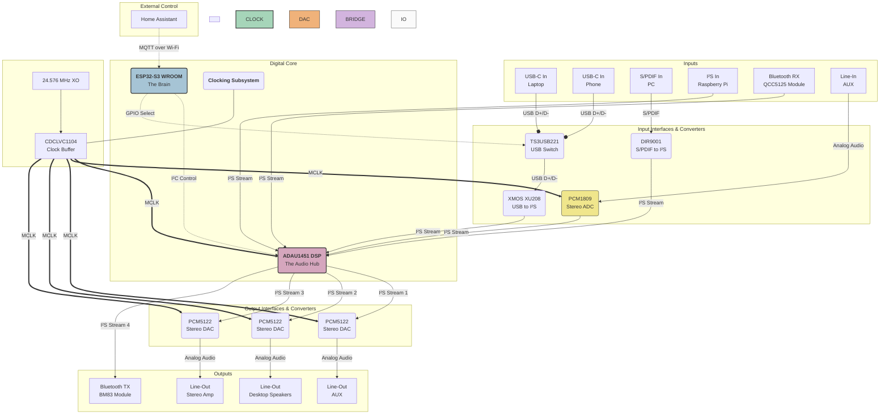

# Project: The HA-Integrated Digital Audio Matrix

## 1. Overview

This document outlines the architecture for a high-fidelity, versatile digital audio matrix and switcher. The system is designed to manage multiple analog and digital audio sources, process them in a central DSP, and route them to various outputs. The entire system is designed to be controlled remotely via Home Assistant (HA) using the MQTT protocol, providing a seamless smart-home integration.

The core design philosophy is to achieve maximum audio quality (96 kHz / 24-bit) and routing flexibility while maintaining a modular, robust, and DIY-friendly architecture.

## 2. Core Features

*   **Flexible 6-Input / 4-Output Matrix:** Mix and route up to 6 stereo sources to 4 independent stereo destinations.
*   **High-Fidelity Audio Path:** End-to-end 96 kHz / 24-bit audio processing.
*   **Comprehensive Connectivity:**
    *   **Inputs:** USB-C (Laptop), USB-C (Phone), S/PDIF (PC), Bluetooth RX (LDAC), Raspberry Pi (I²S), and Analog Line-In (AUX).
    *   **Outputs:** 3x Analog Line-Out (Stereo), Bluetooth TX.
*   **Asynchronous Source Mixing:** A core DSP with integrated Asynchronous Sample Rate Converters (ASRCs) allows simultaneous mixing of digital sources with different clocks (e.g., USB and S/PDIF) without artifacts.
*   **Home Assistant Integration:** Full control over source selection, volume, muting, and presets via MQTT.
*   **Visual DSP Programming:** The audio signal flow (mixing, EQ, dynamics) is configured graphically using Analog Devices' SigmaStudio, drastically reducing firmware complexity.
*   **DIY-Friendly Component Choices:** Prioritizes components in easier-to-solder packages (where possible) and modular, pre-built boards for complex parts (like XMOS).

## 3. System Architecture Diagram

This diagram illustrates the flow of audio and control signals throughout the system.

## 4. Component Selection & Rationale

| # | Component | Qty | Part Number / Type | Rationale (Why this part?) |
|---|---|---|---|---|
| 1 | **Controller** | 1 | `ESP32-S3-WROOM-1U-N8` | **Robust & Future-Proof:** Provides ample Flash (8MB) for future projects. The **`1U`** variant with a U.FL connector is critical for reliable Wi-Fi/Bluetooth performance in a custom enclosure by allowing an external antenna. |
| 2 | **DSP** | 1 | `Analog Devices ADAU1451` | **The Heart of the System:** Powerful enough for all mixing and EQ tasks. Its **integrated ASRCs are non-negotiable** for this project, as they allow clean, simultaneous mixing of asynchronous digital sources (USB, S/PDIF, etc.) without requiring an expensive external SRC chip. |
| 3 | **USB Switch** | 1 | `TI TS3USB221DRCR` | **Smart & Cost-Effective:** Allows two USB-C ports (Laptop, Phone) to share a single, expensive XMOS bridge. The **`DRCR`** (VSON) package is significantly easier to solder in a DIY context than the smaller UQFN variant. |
| 4 | **USB-I²S Bridge**| 1 | `XMOS XU208` Module | **The Industry Standard:** Provides high-quality, driverless USB Audio Class 2 (UAC2) functionality. The **XU208** is fully capable of 96kHz stereo and is a more cost-effective choice than the newer XU316 for this application. Using a pre-made module from a source like AliExpress simplifies the design significantly. |
| 5 | **S/PDIF-I²S Bridge**| 1 | `TI DIR9001` | **Reliable & Simple:** A dedicated, robust S/PDIF receiver that provides a clean I²S stream to the DSP. A proven solution for this specific task. |
| 6 | **Bluetooth RX** | 1 | `QCC5125` Module | **High-Quality Wireless:** Supports the LDAC codec, enabling the highest possible audio quality over Bluetooth. The module provides a direct I²S output for seamless integration with the DSP. |
| 7 | **ADC (Analog)** | 1 | `TI PCM1809` | **Superior Analog Input:** An excellent replacement for the older PCM1808. It offers better performance and, crucially, **does not require external DC-blocking capacitors**, simplifying the analog layout and saving component costs. The TSSOP package is DIY-friendly. |
| 8 | **DACs (Analog)** | 3 | `TI PCM5122` | **The Pragmatic Choice:** Excellent audio performance (112 dB SNR) that is more than sufficient for the target outputs. Its **DirectPath™ technology eliminates the need for large DC-blocking output capacitors**, which saves space and cost. The **TSSOP package** is vital for easy hand-soldering. |
| 9 | **Bluetooth TX** | 1 | `BM83` Module | A capable module that can accept an I²S stream from the DSP and transmit it over Bluetooth, completing the wireless output chain. |
| 10 | **Clock Oscillator**| 1 | `24.576 MHz XO` | **The Foundation of Quality:** This frequency is a perfect integer multiple of audio rates like 48kHz and 96kHz, allowing the DSP's PLL to generate extremely stable, low-jitter system clocks. |
| 11 | **Clock Buffer** | 1 | `TI CDCLVC1104` | **Ensures Signal Integrity:** Takes the single, high-quality clock signal from the XO and distributes clean, strong, and perfectly synchronized copies to all critical audio ICs (DSP, ADC, DACs). This is essential for maintaining low jitter across the entire system. |

## 5. Signal Flow & Control Logic

### Audio Path
1.  **Input:** An audio signal arrives at one of the inputs (e.g., USB from the laptop).
2.  **Conversion:** The corresponding bridge/converter (e.g., the XMOS XU208) converts the signal into a standard I²S digital audio stream. Analog signals are first digitized by the PCM1809 ADC.
3.  **Synchronization:** The I²S stream enters the ADAU1451 DSP. Because the source is asynchronous, the DSP's internal **ASRC** immediately re-clocks the stream to the system's master clock, eliminating any source jitter.
4.  **Processing:** Inside the DSP's core, the now-synchronized audio is mixed with other active sources. Volume, EQ, and other effects (as designed in SigmaStudio) are applied.
5.  **Routing:** The final processed stereo stream is routed to one of the DSP's serial output ports.
6.  **Output:** The I²S stream is sent to the designated output converter (e.g., a PCM5122 DAC), which converts it back to an analog signal for the speakers.

### Control Path
1.  **User Action:** The user changes a setting in the Home Assistant dashboard (e.g., slides the "Desktop Speakers" volume to 50%).
2.  **MQTT Message:** Home Assistant publishes an MQTT message to a specific topic, e.g., `audio/mixer/volume/desktop`, with the payload `50`.
3.  **ESP32 Receives:** The ESP32, connected to Wi-Fi and subscribed to that topic, receives the message.
4.  **Translate & Send:** The ESP32 firmware parses the message and translates it into an I²C command for the DSP. For example, it knows that "Desktop Speakers Volume" corresponds to writing the value for 50% to a specific register address in the ADAU1451.
5.  **DSP Executes:** The ADAU1451 receives the I²C command and instantly updates the gain parameter in its active DSP program. The volume changes smoothly and immediately.
