## Projektplan: Intelligente Lüftersteuerung für High-Fidelity Mediaplayer

## 1. Zielsetzung & Übersicht

Entwicklung eines fortschrittlichen, zentral gesteuerten thermischen Managementsystems für ein High-Fidelity-Mediaplayer-System. Das System soll **Multi-Zonen-fähig** sein und die Temperaturen aller kritischen Hitzekomponenten überwachen. Die Steuerung des leistungsstarken **Arctic P8 Max** PWM-Lüfters erfolgt proaktiv und geräuschoptimiert, basierend auf dem heißesten Punkt des Gesamtsystems.

Die Steuerungslogik wird vollständig auf einen **ESP32-S3** ausgelagert, um den **Raspberry Pi Zero 2W** maximal für seine primäre Audio/Video-Aufgabe zu entlasten.

## 2. Systemarchitektur

Das System basiert auf einer klaren Master-Slave-Architektur mit dem ESP32-S3 als zentralem Controller.

```mermaid
graph TD
    subgraph "Steuerungseinheit (ESP32-S3)"
        A[🧠 ESP32-S3]
    end

    subgraph "Sensoren & Aktoren"
        B[🌡️ TI TMP468 Multi-Sensor]
        C[💨 Arctic P8 Max Lüfter]
    end

    subgraph "Überwachte Komponenten"
        D[Raspberry Pi Zero 2W]
        E[ADAU1451 DSP]
        F[Verstärker]
        G[DACs / ADC]
    end

    A -- "I²C Master" --> B
    A -- "I²C Master" --> D
    A -- "PWM Steuerung" --> C

    B -- "Sensorleitungen" --> E
    B -- "Sensorleitungen" --> F
    B -- "Sensorleitungen" --> G

    D -- "CPU Temp via I²C" --> A
```



* **Gehirn (Master):** Der **ESP32-S3** agiert als I²C-Master. Er sammelt alle Daten, führt die Lüfterlogik aus und steuert den Lüfter.
* **Sensor-Hub:** Der **TI TMP468** dient als zentraler Messpunkt für alle analogen Komponenten. Er ist ein I²C-Slave.
* **Datenquelle:** Der **Raspberry Pi** agiert ebenfalls als I²C-Slave, um seine CPU-Temperatur auf Anfrage bereitzustellen.
* **Aktor:** Der **Arctic P8 Max** wird direkt vom ESP32-S3 über ein PWM-Signal gesteuert.

## 3. Hardware-Implementierung

### 3.1. Sensor-Verkabelung: TI TMP468

Der TMP468 wird zentral auf dem PCB platziert und über seinen I²C-Bus mit dem ESP32 verbunden.

| TMP468 Kanal | Zielkomponente     | Sensortyp & Anschluss                                                       |
|:------------ |:------------------ |:--------------------------------------------------------------------------- |
| **Kanal 1**  | **ADAU1451 DSP**   | **On-Chip Thermal Diode:** `THD_P` an `D+`, `THD_M` an `D-`.                |
| **Kanal 2**  | **Verstärker #1**  | **Externer Transistor (2N3904):** Kollektor+Basis an `D+`, Emitter an `D-`. |
| **Kanal 3**  | **Verstärker #2**  | **Externer Transistor (2N3904):** Wie oben.                                 |
| **Kanal 4**  | **PCM1809 ADC**    | **Externer Transistor (2N3904):** Wie oben.                                 |
| **Kanal 5**  | **PCM5122 DAC #1** | **Externer Transistor (2N3904):** Wie oben.                                 |
| **Kanal 6**  | **PCM5122 DAC #2** | **Externer Transistor (2N3904):** Wie oben.                                 |
| **Kanal 7**  | **PCM5122 DAC #3** | **Externer Transistor (2N3904):** Wie oben.                                 |
| **Kanal 8**  | *Reserve*          | Frei für zukünftige Erweiterungen (z.B. Spannungswandler).                  |

### 3.2. Controller-Verkabelung: ESP32-S3

| ESP32-S3 Pin       | Verbindung zu                                   | Funktion                               |
|:------------------ |:----------------------------------------------- |:-------------------------------------- |
| **GPIO (I²C SDA)** | `SDA` von TMP468 **und** `SDA` von Raspberry Pi | I²C Datenleitung (Pull-up benötigt)    |
| **GPIO (I²C SCL)** | `SCL` von TMP468 **und** `SCL` von Raspberry Pi | I²C Taktleitung (Pull-up benötigt)     |
| **GPIO (PWM)**     | Blaues Kabel (Pin 4) des Arctic P8 Max          | PWM-Steuersignal für den Lüfter        |
| **5V**             | Rotes Kabel (Pin 2) des Arctic P8 Max           | 5V Spannungsversorgung für den Lüfter  |
| **GND**            | Schwarzes Kabel (Pin 1) des Arctic P8 Max       | Masse für Lüfter und I²C-Kommunikation |

### 3.3. Raspberry Pi Konfiguration als I²C-Slave

Der Pi wird als I²C-Slave konfiguriert, was eine zuverlässige Bibliothek erfordert. **Die beste Wahl hierfür ist `pigpio`**.

1. **Aktivieren:** `sudo raspi-config` -> `Interface Options` -> `I2C` -> `Enable`.
2. **`pigpio` Daemon starten:** Der `pigpio` Daemon muss laufen, damit das Skript funktioniert (`sudo systemctl start pigpiod`).

## 4. Kommunikationsprotokoll (ESP32 ↔ Pi)

Ein einfaches Register-basiertes Protokoll wird für die I²C-Kommunikation verwendet.

* **ESP32-S3:** I²C Master
* **Raspberry Pi:** I²C Slave (z.B. an Adresse `0x10`)

| Register (Adresse) | Lese-/Schreibzugriff  | Datenformat | Beschreibung                                                                       |
|:------------------ |:--------------------- |:----------- |:---------------------------------------------------------------------------------- |
| `0x01`             | Nur Lesen (ESP32)     | 1 Byte      | **Ganzzahl-Anteil** der Pi CPU-Temperatur (z.B. `58` für 58.7°C).                  |
| `0x02`             | Nur Lesen (ESP32)     | 1 Byte      | **Nachkomma-Anteil** der Pi CPU-Temperatur, multipliziert mit 100 (z.B. `70`).     |
| `0x10`             | Nur Schreiben (ESP32) | 1 Byte      | Aktuelle Lüftergeschwindigkeit in % (optional, falls Pi den Status anzeigen soll). |

**Ablauf:** Der ESP32 liest zuerst Register `0x01` und dann Register `0x02` vom Pi aus, um die vollständige Temperatur zu erhalten (`58.70`).

## 5. Software-Implementierung

### 5.1. Raspberry Pi: I²C-Slave-Skript (Python)

Dieses Skript läuft als Service im Hintergrund, liest die CPU-Temperatur und stellt sie über den `pigpio` I²C-Slave-Handler bereit.

```python
# pi_i2c_slave.py
import time
import pigpio
import atexit

# --- Konfiguration ---
I2C_SLAVE_ADDRESS = 0x10  # Die I2C-Adresse, auf die der Pi hört
I2C_BUS = 1               # Standard I2C-Bus am Pi

# --- Register-Definitionen ---
REG_TEMP_INT = 0x01
REG_TEMP_FRAC = 0x02
REG_FAN_SPEED = 0x10

# Globale Variablen für den Datenaustausch
pi_temp_int = 0
pi_temp_frac = 0
fan_speed = 0

def get_cpu_temp():
    """Liest die CPU-Temperatur und gibt sie als Ganz- und Nachkomma-Teil zurück."""
    with open('/sys/class/thermal/thermal_zone0/temp', 'r') as f:
        temp_milli = int(f.read())
    temp_c = temp_milli / 1000.0
    return int(temp_c), int((temp_c * 100) % 100)

def i2c_callback(id, tick):
    """Diese Funktion wird von pigpio aufgerufen, wenn eine I2C-Aktivität stattfindet."""
    global fan_speed
    s, b, d = pi.bsc_i2c(I2C_SLAVE_ADDRESS) # Status der I2C-Transaktion abrufen

    if b > 0: # Wenn Daten geschrieben wurden (ESP32 sendet)
        # Beispiel: Lüftergeschwindigkeit vom Master empfangen
        if d[0] == REG_FAN_SPEED and b > 1:
            fan_speed = d[1]
            print(f"Lüftergeschwindigkeit vom Master erhalten: {fan_speed}%")

# --- Hauptprogramm ---
pi = pigpio.pi()
if not pi.connected:
    exit()

# Sicherstellen, dass die Ressourcen bei Skriptende freigegeben werden
atexit.register(pi.bsc_i2c, 0) 
pi.bsc_i2c(I2C_SLAVE_ADDRESS) # I2C-Slave-Modus aktivieren

print(f"I2C-Slave auf Adresse {hex(I2C_SLAVE_ADDRESS)} gestartet. Warte auf Master...")

try:
    while True:
        # 1. Aktuelle CPU-Temperatur lesen
        pi_temp_int, pi_temp_frac = get_cpu_temp()

        # 2. Datenpuffer für den I2C-Slave vorbereiten
        # pigpio erfordert eine Liste von Bytes. Wir erstellen einen 256-Byte-Puffer.
        data_buffer = [0] * 256
        data_buffer[REG_TEMP_INT] = pi_temp_int
        data_buffer[REG_TEMP_FRAC] = pi_temp_frac

        # 3. Den Slave mit den neuen Daten "füttern"
        pi.bsc_i2c(I2C_SLAVE_ADDRESS, data_buffer)

        time.sleep(2) # Aktualisierungsintervall

except KeyboardInterrupt:
    print("\nSkript beendet.")
finally:
    pi.bsc_i2c(0) # Slave deaktivieren
    pi.stop()
```

### 5.2. ESP32-S3: Controller-Software (Arduino C++ Logik)

Dies ist das Herzstück, das alle Fäden zusammenführt.

```cpp
#include <Wire.h>

// --- Konfiguration ---
#define PI_I2C_ADDR 0x10
#define TMP468_I2C_ADDR 0x4C // Beispieladresse, im Datenblatt prüfen!
#define FAN_PWM_PIN 18

// --- Lüfterkurve ---
const float FAN_START_TEMP = 55.0;
const float FAN_MAX_TEMP = 75.0;
const float FAN_MIN_SPEED = 20.0;
const float HYSTERESIS = 5.0;
bool fan_is_on = false;

// --- PWM-Setup ---
const int PWM_CHANNEL = 0;
const int PWM_FREQ = 25000;
const int PWM_RESOLUTION = 8; // 0-255

void setup() {
  Serial.begin(115200);
  Wire.begin(); // ESP32 als I2C Master starten

  // Lüfter-PWM konfigurieren
  ledcSetup(PWM_CHANNEL, PWM_FREQ, PWM_RESOLUTION);
  ledcAttachPin(FAN_PWM_PIN, PWM_CHANNEL);
  ledcWrite(PWM_CHANNEL, 0); // Lüfter initial aus
  Serial.println("System-Controller gestartet.");
}

void loop() {
  // 1. Alle Temperaturen sammeln
  float pi_temp = getPiTemperature();
  float dsp_temp = getTMP468Temperature(1);
  float amp1_temp = getTMP468Temperature(2);
  // ... weitere Sensoren abfragen

  // 2. Den heißesten Punkt im System finden ("Hotspot")
  float max_temp = 0.0;
  max_temp = max(max_temp, pi_temp);
  max_temp = max(max_temp, dsp_temp);
  max_temp = max(max_temp, amp1_temp);
  // ... alle weiteren Temperaturen vergleichen

  // 3. Lüfter-Geschwindigkeit basierend auf dem Hotspot berechnen
  int fan_speed_percent = calculateFanSpeed(max_temp);

  // 4. PWM-Signal für den Lüfter setzen
  int pwm_value = (fan_speed_percent * 255) / 100;
  ledcWrite(PWM_CHANNEL, pwm_value);

  // 5. Status ausgeben
  Serial.printf("Hotspot-Temp: %.2f°C | Pi: %.2f°C | DSP: %.2f°C | Lüfter: %d%%\n", 
                max_temp, pi_temp, dsp_temp, fan_speed_percent);

  delay(3000); // 3 Sekunden warten bis zur nächsten Messung
}

// --- Hilfsfunktionen ---

float getPiTemperature() {
  Wire.requestFrom(PI_I2C_ADDR, 2); // Fordere 2 Bytes an
  if (Wire.available() >= 2) {
    byte temp_int = Wire.read();
    byte temp_frac = Wire.read();
    return (float)temp_int + ((float)temp_frac / 100.0);
  }
  return -1.0; // Fehlerwert
}

float getTMP468Temperature(int channel) {
  // Hier kommt die Logik zum Auslesen des TMP468.
  // Dies erfordert das Senden von Befehlen an den Chip, um das
  // Register für den gewünschten Kanal auszuwählen und dann den Wert zu lesen.
  // (Beispiel, muss an Datenblatt angepasst werden)
  Wire.beginTransmission(TMP468_I2C_ADDR);
  Wire.write(0x08); // Pointer auf Remote Temp Register von Kanal X setzen
  Wire.write(1 << channel); 
  Wire.endTransmission();

  Wire.requestFrom(TMP468_I2C_ADDR, 1);
  if(Wire.available()){
    return (float)Wire.read();
  }
  return -1.0; // Fehlerwert
}

int calculateFanSpeed(float temp) {
    if (!fan_is_on && temp >= FAN_START_TEMP) {
        fan_is_on = true;
    } else if (fan_is_on && temp < (FAN_START_TEMP - HYSTERESIS)) {
        fan_is_on = false;
    }

    if (!fan_is_on) return 0;

    if (temp >= FAN_MAX_TEMP) return 100;

    float speed = FAN_MIN_SPEED + ((temp - FAN_START_TEMP) / (FAN_MAX_TEMP - FAN_START_TEMP)) * (100.0 - FAN_MIN_SPEED);
    return max((int)FAN_MIN_SPEED, min(100, (int)speed));
}
```

## 6. Zusammenfassung der Vorteile dieses Designs

* **Maximale Performance:** Der Raspberry Pi wird von allen Echtzeit-Steuerungsaufgaben befreit.
* **Ganzheitliche Kühlung:** Das System reagiert auf den *tatsächlichen* Hotspot, egal ob es der DSP, ein Verstärker oder die CPU ist.
* **Robustheit:** Klare Trennung der Aufgaben. Fällt eine Komponente aus, kann der ESP32 intelligent reagieren (z.B. Lüfter auf 100% schalten, wenn Pi nicht mehr antwortet).
* **Skalierbarkeit:** Dank des TMP468 können problemlos weitere Sensoren hinzugefügt werden.
* **Effizienz:** Der ESP32-S3 ist extrem stromsparend und perfekt für 24/7-Managementaufgaben geeignet.
